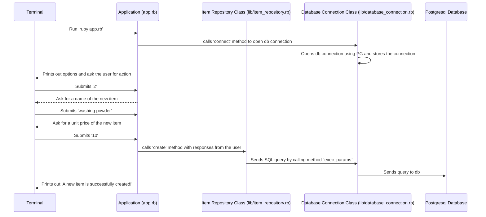
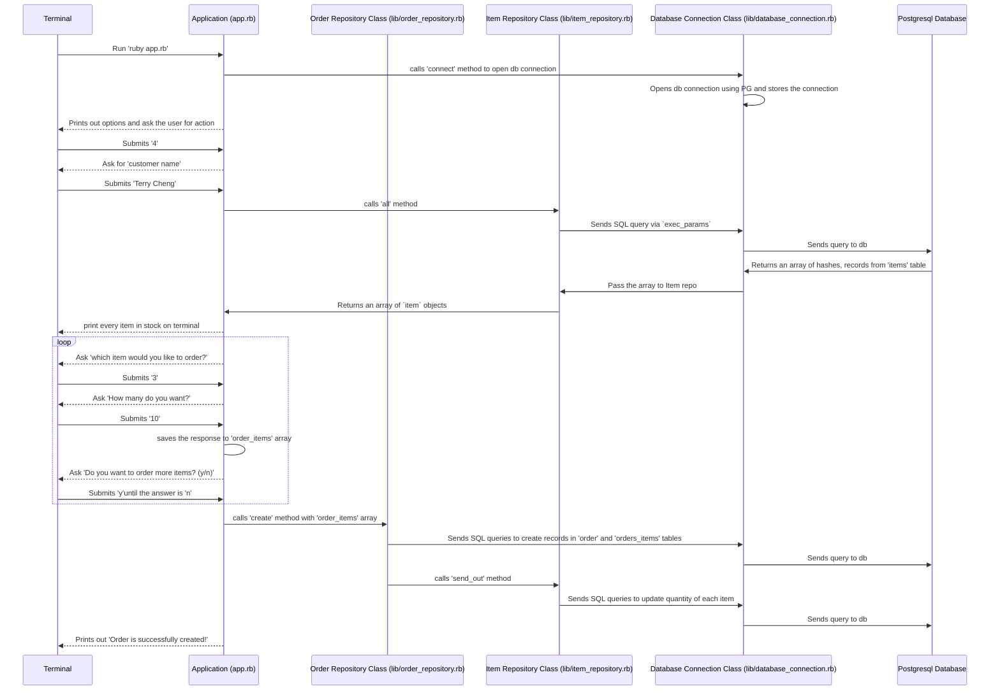

# Shop Manager Challenge

This is a Ruby-based program to manage a shop's database, which is the 2nd solo project from Makers coding bootcamp.

What I've lernt so far, including TDD, OOP, SQL, will be applied to this project.

**Demo**

```
Welcome to the shop management program!

What do you want to do?
  1 = list all shop items
  2 = create a new item
  3 = list all orders
  4 = create a new order

1 [enter]

Here's a list of all shop items:

  #1 Super Shark Vacuum Cleaner - Unit price: 99 - Quantity: 30
  #2 Makerspresso Coffee Machine - Unit price: 69 - Quantity: 15
  (...)
```

## Table of Contents

- [Shop Manager Challenge](#shop-manager-challenge)
  - [Table of Contents](#table-of-contents)
  - [Phase 1: Requirements \& Planning](#phase-1-requirements--planning)
    - [User Stories](#user-stories)
    - [Goals](#goals)
    - [Database Diagram](#database-diagram)
    - [Workflow Diagrams](#workflow-diagrams)
  - [Phase 2: Class \& Test design](#phase-2-class--test-design)
    - [Classes](#classes)
    - [Tests](#tests)
  - [Phase 3: Getting Started](#phase-3-getting-started)
    - [Install gems](#install-gems)
    - [Run tests](#run-tests)
  - [Dependencies](#dependencies)
  - [Contributors](#contributors)

## Phase 1: Requirements & Planning

### User Stories

These are given by Makers as a starting point of the challenge. Instruction details can be viewed from [this doc](doc/instructions.md).

```
As a shop manager
So I can know which items I have in stock
I want to keep a list of my shop items with their name and unit price.

As a shop manager
So I can know which items I have in stock
I want to know which quantity (a number) I have for each item.

As a shop manager
So I can manage items
I want to be able to create a new item.

As a shop manager
So I can know which orders were made
I want to keep a list of orders with their customer name.

As a shop manager
So I can know which orders were made
I want to assign each order to their corresponding item.

As a shop manager
So I can know which orders were made
I want to know on which date an order was placed.

As a shop manager
So I can manage orders
I want to be able to create a new order.

```

---

### Goals

Here are the goals I'd like to achieve about this project:

- A well-structured interactive terminal interface
- Order can handle multiple items instead of just one
- 95%+ test coverage (by using `RSpec`)
- Making good documentation of the programme

---

### Database Diagram

Database planning is the key of this project as every class design will be based on this.

A joint table `orders_items` is served as a bridge between `items` and `orders` tables to maintain the many-to-many relationship.


---

### Workflow Diagrams

Before diving into codes, I made the following diagrams to plan further for the workflow of this programme. This allows me to think carefully about the system without missing any essential steps.

<details>
    <summary><b>Flow 1: Creating a new item</b></summary>



</details>

---

<details>
<summary><b>Flow 2: Creating a new order</b></summary>



</details>

## Phase 2: Class & Test design

### Classes

All class deisgns can be viewed in [this doc](doc/class-design.md).

### Tests

All test designs can be viewed in [this doc](doc/test-deisgn.md).

## Phase 3: Getting Started

> Before running any commands, please make sure `Ruby` has been installed in your local environment. Otherwise, please follow the instructions on [Ruby offical website](https://www.ruby-lang.org/en/downloads/).

### Install gems

`Gemfile` is ready in this project. Details of each gem can be found [here](Gemfile). Just run the following command and everything you need to run this programme will be installed.

```
bundle
```

### Run tests

`RSpec` is the testing library of this programmer. Runing the following commands to run the test(s).

```sh
# run all tests
rspec

# run a single test
rspec spec/{FILE NAME}_spec.rb
```

## Dependencies

- Ruby ~3.0.2
- pg ~1.3.5
- rubocop ~1.2
- RSpec ~3.1.0

## Contributors

- [@terryhycheng](https://github.com/terryhycheng/)
