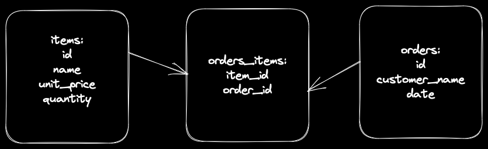

## Extract nouns from the user stories or specification
```plain
As a shop manager
So I can know which items I have in stock
I want to keep a list of my shop items with their name and unit price.

As a shop manager
So I can know which items I have in stock
I want to know which quantity (a number) I have for each item.

As a shop manager
So I can manage items
I want to be able to create a new item.

As a shop manager
So I can know which orders were made
I want to keep a list of orders with their customer name.

As a shop manager
So I can know which orders were made
I want to assign each order to their corresponding item.

As a shop manager
So I can know which orders were made
I want to know on which date an order was placed. 

As a shop manager
So I can manage orders
I want to be able to create a new order.
```
```plain
nouns: stock, items, items_name, items_unit_price, items_quantity, orders, orders_customer_name, order_item, order_date
```
## Infer the Table Name and Columns
```plain
Record | Properties
item | name, unit_price, quantity
order | customer_name, date

Name of the first table (always plural): items

Column names: id, name, unit_price, quantity

Name of the second table (always plural): orders

Column names: id, customer_name, date
```
## Decide the column types.
```plain
items:
id SERIAL
name text
unit_price int
quantity int

orders:
id SERIAL
customer_name
date date
```
## Design the Many-to-Many relationship
```plain
Join table for tables: items and orders
Join table name: items_orders
Columns: item_id, order_id
```

## Write the SQL.
```sql
-- Create the first table.
CREATE TABLE items (
  id SERIAL PRIMARY KEY,
  name text,
  unit_price int,
  quantity int
);

-- Create the second table.
CREATE TABLE orders (
  id SERIAL PRIMARY KEY,
  customer_name text,
  date date
);

-- Create the join table.
CREATE TABLE orders_items (
  item_id int,
  order_id int,
  constraint fk_items foreign key(item_id) references items(id) on delete cascade,
  constraint fk_orders foreign key(order_id) references orders(id) on delete cascade
);
```
## Create the tables.
```zsh
psql -h 127.0.0.1 stock_control < stock_control.sql
```